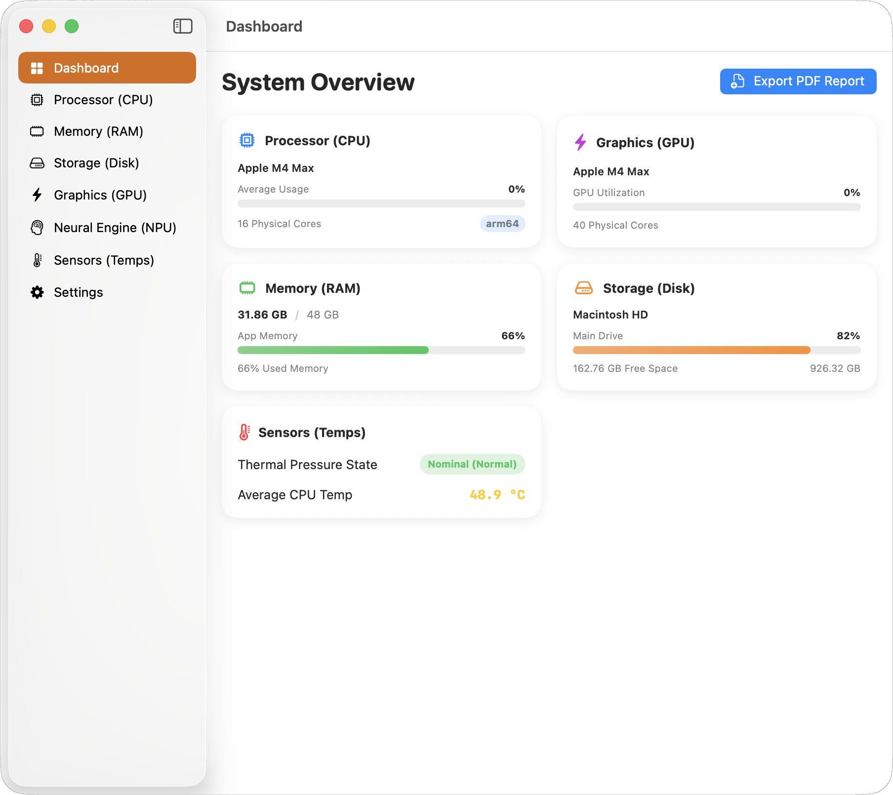

# 💻 MaquinaInfo

[](https://developer.apple.com/macos/)
[](https://developer.apple.com/apple-silicon/)
[](https://swift.org/)
[](https://developer.apple.com/xcode/swiftui/)

A premium, state-of-the-art hardware telemetry and monitoring application designed exclusively for macOS on **Apple Silicon** computers. 

**MaquinaInfo** provides an elegant, dark-mode-first dashboard packed with real-time hardware diagnostics, custom localization, PDF report generation, and full App Store Sandbox compliance.

---

## 📸 Preview



---

## ✨ Features

- **📊 Comprehensive Dashboard**: A high-level overview featuring circular gauges for CPU activity, dynamic storage meters, memory usage bar dividers, and thermal health indicators.
- **🛡️ Apple Silicon Optimized**: Programmatic detection blocks Intel-based Macs at launch, ensuring zero resource waste and perfect hardware alignment for M1, M2, M3, M4, and future Apple Silicon processors.
- **🌀 Real-Time Core Activity**: View real-time loading loops for individual CPU cores in an animated ring grid.
- **⚡ Advanced GPU Telemetry**: Tracks overall device usage, tiler, and renderer utilization (for direct distribution builds).
- **🧠 Neural Engine (NPU) details**: Displays core counts, driver properties, and ANE architecture versions.
- **💾 Segmented Memory Analysis**: Visual breakdown of RAM division into Wired, App Memory, Compressed, and Free pools.
- **🌡️ Thermal Sensor Metrics**: Detailed list of system temperature sensors mapped directly from the IOHID Event System (Direct distribution only).
- **🌎 Live Localization**: Instantly switch languages (English, Spanish, Portuguese) on the fly directly inside the Settings view.
- **📄 PDF Report Exporter**: Generate a beautifully formatted hardware snapshot document with a single click and export it to a PDF file.

---

## 🛠️ Sandbox & Distribution Modes

To comply with Apple's strict **App Store Sandboxing** guidelines while still offering maximum performance details to advanced users, MaquinaInfo supports two compilation targets:

### 1. App Store Sandbox Mode (Safe)
*   **Compilation Flag**: `-D APP_STORE`
*   **Behavior**: Bypasses any private dynamic linking (`IOHIDEventSystemClient` for temperatures and `IOAccelerator` PerformanceStatistics). 
*   **Telemetries**: GPU information falls back to the public `Metal` framework APIs (`MTLCreateSystemDefaultDevice()?.name`), and private metrics are hidden gracefully to ensure approval.

### 2. Direct Distribution Mode (Full Details)
*   **Compilation Flag**: None (Default)
*   **Behavior**: Dynamically loads `IOKit` kernel telemetry interfaces to pull raw core activities, tiler/renderer stats, and specific chip temperature dies.

---

## 🚀 How to Build

Open `MaquinaInfo.xcodeproj` in Xcode 15 or higher, or compile from the command line:

### Build for Direct Distribution (Default)
```bash
xcodebuild -scheme MaquinaInfo -configuration Release build
```

### Build for App Store Sandbox Submission
```bash
xcodebuild -scheme MaquinaInfo -configuration Release OTHER_SWIFT_FLAGS="-D APP_STORE" build
```

---

## 🔓 Running the Pre-compiled App (Gatekeeper Bypass)

When downloading the pre-compiled `MaquinaInfo.zip` directly from GitHub releases, macOS Gatekeeper may show a warning: **"Apple could not verify MaquinaInfo is free of malware..."**

This happens because the release build is signed ad-hoc and is not notarized using a paid Apple Developer ID certificate. 

To open and run the app, you can use either of these methods:

### Method 1: The Standard macOS Way
1. Open your **Finder** and locate the extracted `MaquinaInfo.app`.
2. **Right-click (or Control-click)** the app icon and select **Open** from the context menu.
3. Click **Open** in the confirmation dialog that appears. (This registers a permanent exception for this app).

### Method 2: Strip the Quarantine Attribute via Terminal
If you prefer, you can clear the browser-applied quarantine flag by running this command in your Terminal:
```bash
xattr -cr /path/to/MaquinaInfo.app
```

---

## 👤 Credits

*   **Lead Developer**: Roberto A. Berrospe Machin (Ruta Internet S.R.L.)
*   **AI Pair Programming Partners**: Gemini & Antigravity (Google DeepMind Advanced Agentic Coding Team)
